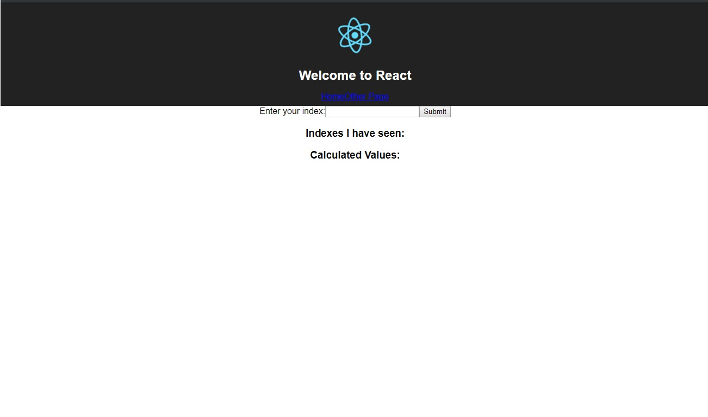

# Multi-Container Application

## Development Flow:
1. Browser connects to Nginx server.
1. Nginx Server connects to React Server.
    - For front-end content.
1. Ngnix Server connects to Express Server.
    - For APIs.
1. Express Server will connect to Redis DB.
    1. Redis Server will connect to Worker Service to calculate value.
1. Express Server will connect to Postgres.
    - To retrive already calculated values.

## Running containers locally
*Before runnning container locally please make sure you have changed the $(pwd) in **docker-compose.yml** to suit your current working directory.*
```
docker-compose up
```

## The Application
